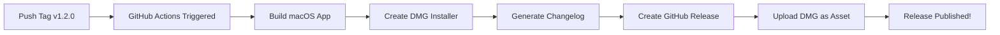

# GitHub Automatic Release Setup

## ✅ Complete Setup Delivered

Your Video2PPT project now has a complete GitHub Actions release automation system!

## 📦 What's Been Added

### 1. **GitHub Actions Workflows** (`.github/workflows/`)

#### `release.yml` - Main Release Workflow
- **Triggers**: On semantic version tags (`v*.*.*`)
- **Actions**:
  - Builds macOS app with Xcode
  - Creates professional DMG installer
  - Generates changelog from commits
  - Creates GitHub release with DMG attachment
  - Supports manual trigger via workflow_dispatch

#### `release-signed.yml` - Code-Signed Release (Optional)
- For signed releases with Apple Developer certificate
- Requires GitHub secrets configuration
- Includes notarization support
- Creates trusted DMG without Gatekeeper warnings

#### `test.yml` - CI Testing
- Runs on pull requests and pushes
- Tests build process
- Validates Python module
- Checks code quality

### 2. **Release Scripts** (`scripts/`)

#### `release.sh` - Interactive Release Creator
```bash
./scripts/release.sh
```
- Interactive version selection (major/minor/patch)
- Automatic version bumping
- Git tag creation
- Push to trigger GitHub Actions

#### `test-release.sh` - Local Testing
```bash
./scripts/test-release.sh
```
- Tests build process locally
- Validates environment setup
- Simulates release process

### 3. **Documentation**

- **RELEASING.md**: Complete release guide
- **CHANGELOG.md**: Version history template
- **GITHUB_RELEASE_SETUP.md**: This setup guide

## 🚀 How to Use

### Quick Release (Recommended)

```bash
# 1. Make sure you're on main branch with clean working tree
git checkout main
git pull

# 2. Run the release script
./scripts/release.sh

# 3. Select version type:
#    - Major (1.0.0 → 2.0.0): Breaking changes
#    - Minor (1.0.0 → 1.1.0): New features
#    - Patch (1.0.0 → 1.0.1): Bug fixes

# 4. Script will create tag and push to GitHub
# 5. GitHub Actions automatically builds and releases
```

### Manual Release

```bash
# Create semantic version tag
git tag -a v1.2.0 -m "Release v1.2.0: New features"

# Push tag to trigger workflow
git push origin v1.2.0

# Monitor at: https://github.com/markshawn2020/video2ppt/actions
```

## 🔄 Workflow Process



## ⚙️ Configuration

### Required Settings (Already Done)
- ✅ Workflows in `.github/workflows/`
- ✅ Scripts in `scripts/`
- ✅ Documentation files

### Optional: Code Signing

To enable signed releases, add these GitHub secrets:

1. Go to: Settings → Secrets → Actions
2. Add:
   - `APPLE_CERTIFICATE`: Base64 encoded .p12 certificate
   - `APPLE_CERTIFICATE_PASSWORD`: Certificate password
   - `APPLE_TEAM_ID`: Your Apple Team ID
   - `APPLE_IDENTITY`: "Developer ID Application: Name (ID)"

## 📊 Release Outputs

Each release will include:

- **DMG File**: `Video2PPT-v1.2.0.dmg`
- **Release Notes**: Auto-generated from commits
- **Changelog**: Version history
- **Download Link**: Direct DMG download

## 🧪 Testing

### Test Locally First
```bash
# Test the release process without pushing
./scripts/test-release.sh
```

### Test GitHub Actions
```bash
# Create test tag
git tag v0.0.1-test
git push origin v0.0.1-test

# Check Actions tab on GitHub
# Delete test tag after
git push origin --delete v0.0.1-test
```

## 📈 Semantic Versioning

Your releases should follow this pattern:

| Version | When to Use | Example |
|---------|------------|---------|
| **Major** `vX.0.0` | Breaking changes | `v2.0.0` |
| **Minor** `v1.X.0` | New features | `v1.1.0` |
| **Patch** `v1.0.X` | Bug fixes | `v1.0.1` |
| **Pre-release** | Testing | `v1.0.0-beta.1` |

## 🎯 Next Steps

1. **Test the setup**:
   ```bash
   ./scripts/test-release.sh
   ```

2. **Create your first release**:
   ```bash
   ./scripts/release.sh
   # Choose "patch" for v0.0.1
   ```

3. **Monitor the build**:
   - Go to [Actions tab](https://github.com/markshawn2020/video2ppt/actions)
   - Watch the release workflow

4. **Check the release**:
   - Visit [Releases page](https://github.com/markshawn2020/video2ppt/releases)
   - Download and test the DMG

## 🎉 Features Summary

- ✅ **Automatic DMG creation** on version tag push
- ✅ **Changelog generation** from git commits
- ✅ **GitHub Release** with download links
- ✅ **Version management** scripts
- ✅ **CI/CD testing** on pull requests
- ✅ **Optional code signing** support
- ✅ **Manual trigger** option
- ✅ **Pre-release** support (beta/alpha)

## 📝 Commit Message Format

For better changelogs, use conventional commits:

```bash
feat: add new feature
fix: resolve bug
docs: update documentation
chore: routine task
build: build system change
ci: CI/CD change
```

## 🆘 Troubleshooting

If release fails:

1. Check [GitHub Actions logs](https://github.com/markshawn2020/video2ppt/actions)
2. Ensure Xcode project builds locally
3. Verify tag format is `v*.*.*`
4. Check file permissions on scripts

## 🎊 Ready to Release!

Your project is now fully configured for automatic releases. Every time you push a semantic version tag, GitHub will automatically build and publish a release with a DMG installer.

Happy releasing! 🚀