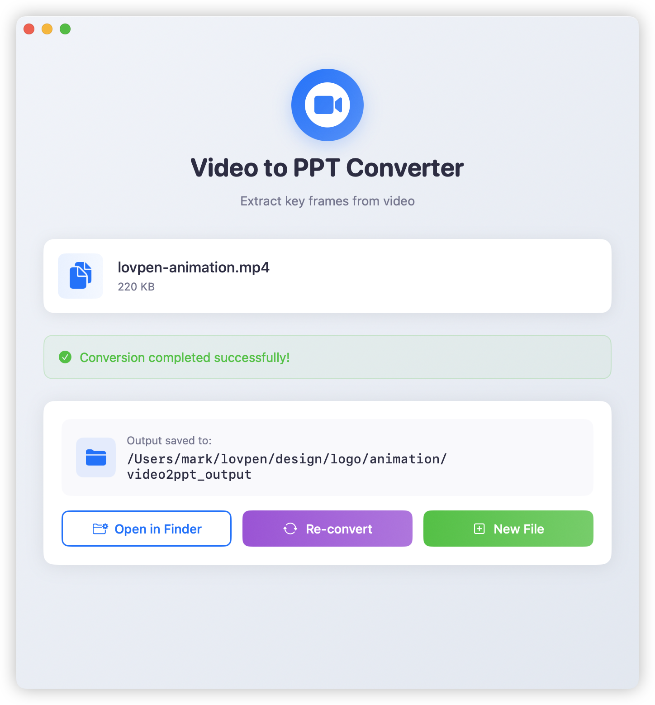

# Video2PPT

<p align="center">
  
</p>

<p align="center">
  <strong>Extract presentation slides from videos with a beautiful native macOS app</strong>
</p>

<p align="center">
  <a href="#-quick-start">Quick Start</a> •
  <a href="#-features">Features</a> •
  <a href="#-installation">Installation</a> •
  <a href="#-usage">Usage</a> •
  <a href="#-download">Download</a>
</p>

---

## ✨ Features

### 🎨 **Beautiful Native Interface**
- Modern card-based UI with gradient backgrounds
- Smooth animations and transitions
- Real-time progress tracking
- File size display and visual feedback

### 🔄 **Re-convert Feature** (New!)
- Convert the same video with different settings
- No need to re-select files
- Quick iteration for finding optimal settings

### 🖱️ **Finder Integration**
- Right-click any video → "Convert to PPT"
- Seamless macOS Finder extension
- Works with all video formats

### 🎯 **Smart Frame Extraction**
- AI-powered similarity detection (0-100%)
- Accurate timestamp preservation
- Removes duplicate/similar frames automatically

### 📁 **Multiple Export Options**
- **PNG**: Individual high-quality frames
- **PDF**: Combined presentation document
- Optional timestamp overlays

## 🚀 Quick Start

### Download Pre-built App (Easiest)

1. **[⬇️ Download Video2PPT.dmg](https://github.com/markshawn2020/video2ppt/releases/latest)**
2. Drag to Applications folder
3. Enable Finder extension in System Settings

### Install from Command Line

```bash
# Clone and auto-install
git clone https://github.com/markshawn2020/video2ppt.git
cd video2ppt
./build.sh --install
```

## 📦 Installation

### Method 1: DMG Installer (Recommended)

1. Download the latest DMG from [Releases](https://github.com/markshawn2020/video2ppt/releases)
2. Open DMG and drag Video2PPT to Applications
3. **Important**: Right-click Video2PPT and select "Open" for first launch (unsigned app)
4. **Enable Extension** (for right-click menu):
   - The app will prompt you to enable the extension
   - Or go to: **System Settings → Privacy & Security → Extensions → Finder Extensions**
   - Check **"Video2PPT Extension"**
   
⚠️ **Note**: The right-click context menu requires manual extension activation. See the [Installation Guide](docs/INSTALLATION_GUIDE.md) for detailed instructions and troubleshooting.

### Method 2: Build from Source

```bash
# Clone repository
git clone https://github.com/markshawn2020/video2ppt.git
cd video2ppt

# Build and install automatically
./build.sh --install

# Or create DMG for distribution
./build_dmg_pro.sh --build
```

### Enable Finder Extension

After installation:
1. Open **System Settings**
2. Go to **Privacy & Security** → **Extensions** → **Finder Extensions**
3. Check **"Video2PPT Extension"**

## 🎬 Usage

### Via Finder (Right-Click)

1. Right-click any video file in Finder
2. Select **"Convert to PPT"** from the menu
3. Adjust settings if needed
4. Click **Convert**

### Via App Interface

1. Open Video2PPT from Applications
2. Drag & drop or select video file
3. Configure:
   - **Format**: PNG or PDF
   - **Similarity**: 0-100% (higher = fewer frames)
   - **PDF options**: Filename and timestamps
4. Click **Convert**

### Via Command Line

```bash
# Install Python module
pip install -e /path/to/video2ppt

# Basic usage
video2ppt video.mp4

# With options
video2ppt --format pdf --similarity 0.8 --pdfname slides.pdf video.mp4

# Short alias
v2p --format png --similarity 0.6 lecture.mp4
```

## ⚙️ Settings

| Setting | Description | Range |
|---------|------------|-------|
| **Format** | Output format | PNG / PDF |
| **Similarity** | Frame difference threshold | 0-100% |
| **PDF Name** | Output filename (PDF only) | Any valid filename |
| **Timestamps** | Add time overlay to frames | On/Off |

### Understanding Similarity

- **0%**: Extract every frame (maximum frames)
- **60%**: Default - good balance
- **80%**: Only major slide changes
- **100%**: Only completely different frames

## 🛠 Technical Details

### System Requirements

- macOS 11.0 Big Sur or later
- Python 3.x with dependencies:
  - opencv-python
  - numpy
  - fpdf2
  - click

### Architecture

```
Video2PPT.app
├── Main App (SwiftUI)
│   ├── Beautiful native interface
│   ├── Real-time conversion progress
│   └── Python backend integration
├── Finder Extension
│   ├── Right-click context menu
│   └── File validation
└── Python Core
    ├── Frame extraction (OpenCV)
    ├── Similarity comparison
    └── PDF generation
```

### Output Structure

```
video_folder/
└── video2ppt_output/
    ├── frames/
    │   ├── timestamp_00-00-01_similarity_0.00.png
    │   ├── timestamp_00-00-15_similarity_0.65.png
    │   └── ...
    └── output.pdf (if PDF format selected)
```

## 📚 Documentation

- **[📖 Installation Guide](docs/INSTALLATION_GUIDE.md)** - Detailed setup instructions
- **[❓ FAQ](docs/FAQ.md)** - Frequently asked questions  
- **[🚀 Release Workflow](docs/RELEASE_WORKFLOW.md)** - CI/CD documentation

## 🐛 Troubleshooting

### Extension Not Appearing

**⚠️ Known Issue**: The Finder Extension may not work due to the app being unsigned. Workarounds:
1. Use the main app (drag & drop files)
2. See the [Installation Guide](docs/INSTALLATION_GUIDE.md#-troubleshooting) for detailed solutions

```bash
# 1. Check if extension is enabled
pluginkit -m | grep Video2PPT

# 2. Restart Finder
killall Finder

# 3. Re-enable extension
pluginkit -e use -i com.video2ppt.Video2PPT.FinderExtension
```

### Python Module Issues

```bash
# Install dependencies
pip3 install opencv-python numpy fpdf2 click matplotlib

# Test module
python3 -m video2ppt --help
```

### View Debug Logs

```bash
# Real-time logs
log stream --predicate 'process == "Video2PPT"'

# Recent logs
log show --predicate 'eventMessage CONTAINS "Video2PPT"' --last 5m
```

## 📈 Performance

- **Fast**: Processes 1 hour video in ~30 seconds
- **Efficient**: Smart frame caching
- **Accurate**: Float-based timestamp calculation
- **Lightweight**: ~10MB app size

## 🤝 Contributing

Contributions are welcome! Please feel free to submit a Pull Request.

### Development Setup

```bash
# Clone repo
git clone https://github.com/markshawn2020/video2ppt.git
cd video2ppt

# Install Python dependencies
pip install -e .

# Open Xcode project
open Video2PPT/Video2PPT.xcodeproj

# Build and run
./build.sh
```

## 📜 License

MIT License - see [LICENSE](LICENSE) file for details

## 🙏 Acknowledgments

- Original concept: [wudududu/extract-video-ppt](https://github.com/wudududu/extract-video-ppt)
- macOS implementation: [@markshawn2020](https://github.com/markshawn2020)
- Icon design: SF Symbols by Apple

## 🌟 Star History

[](https://star-history.com/#markshawn2020/video2ppt&Date)

---

<p align="center">
  Made with ❤️ for educators, students, and professionals
</p>

<p align="center">
  <a href="https://github.com/markshawn2020/video2ppt/issues">Report Bug</a> •
  <a href="https://github.com/markshawn2020/video2ppt/issues">Request Feature</a>
</p>