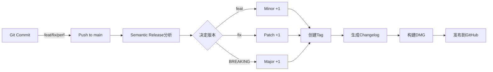

# 🚀 Semantic Release 自动化版本管理指南

## 📋 概述

Semantic Release 是一个**全自动化**的版本管理和发布系统，它可以：

- ✅ **自动决定版本号** - 根据commit类型自动升级版本
- ✅ **自动创建Git标签** - 无需手动打tag
- ✅ **自动生成更新日志** - 从commit messages生成CHANGELOG
- ✅ **自动发布到GitHub** - 创建Release并上传DMG
- ✅ **自动更新版本文件** - 同步所有版本号

## 🎯 核心优势

### 传统方式 vs Semantic Release

| 操作 | 传统方式 | Semantic Release |
|------|---------|------------------|
| 决定版本号 | 手动思考 | 自动根据commit类型 |
| 创建标签 | `git tag -a v1.0.0` | 自动创建 |
| 更新CHANGELOG | 手动编写 | 自动生成 |
| 创建Release | 手动在GitHub创建 | 自动创建并上传资源 |
| 版本一致性 | 容易遗漏文件 | 自动同步所有文件 |

## 🔄 工作流程



## 📝 Commit规范 (Conventional Commits)

### 基本格式
```
<type>(<scope>): <subject>

<body>

<footer>
```

### 类型对应版本变化

| Commit类型 | 版本变化 | 示例 | 结果 |
|-----------|---------|------|------|
| `feat:` | Minor (1.**X**.0) | `feat: add re-convert button` | 1.0.0 → 1.1.0 |
| `fix:` | Patch (1.0.**X**) | `fix: correct timestamp error` | 1.0.0 → 1.0.1 |
| `perf:` | Patch | `perf: optimize frame extraction` | 1.0.1 → 1.0.2 |
| `docs:` | No release | `docs: update README` | 不触发发布 |
| `style:` | No release | `style: format code` | 不触发发布 |
| `refactor:` | Patch | `refactor: restructure UI code` | 1.0.2 → 1.0.3 |
| `feat!:` | Major (**X**.0.0) | `feat!: change API` | 1.0.3 → 2.0.0 |

### 实际例子

```bash
# 新功能 - Minor版本升级 (1.0.0 → 1.1.0)
git commit -m "feat: add dark mode support"
git commit -m "feat(ui): implement settings panel"

# Bug修复 - Patch版本升级 (1.1.0 → 1.1.1)
git commit -m "fix: resolve memory leak in video processing"
git commit -m "fix(finder): correct extension registration"

# 重大变更 - Major版本升级 (1.1.1 → 2.0.0)
git commit -m "feat!: redesign entire UI architecture"
# 或者
git commit -m "feat: new video format support

BREAKING CHANGE: removed support for AVI format"

# 不触发发布的commit
git commit -m "docs: add installation guide"
git commit -m "style: apply prettier formatting"
git commit -m "chore: update dependencies"
```

## 🛠 初始设置

### 1. 安装依赖
```bash
# 运行设置脚本
chmod +x scripts/setup-semantic-release.sh
./scripts/setup-semantic-release.sh

# 或手动安装
npm install
npx husky install
```

### 2. 配置GitHub Token
确保GitHub Actions有正确的权限：
- Settings → Actions → General → Workflow permissions
- 选择 "Read and write permissions"

## 🎮 使用方法

### 方式1: 交互式Commit (推荐新手)
```bash
# 使用交互式工具创建规范的commit
npm run commit

# 会引导你选择：
# ? Select the type of change (feat/fix/docs...)
# ? What is the scope of this change?
# ? Write a short description
```

### 方式2: 直接Commit
```bash
# 符合规范的commit会被接受
git commit -m "feat: add export to PDF feature"

# 不符合规范会被拒绝
git commit -m "updated code"  # ❌ 会被commitlint阻止
```

### 方式3: 跳过Hooks (紧急情况)
```bash
# 跳过所有检查（不推荐）
git commit -m "emergency fix" --no-verify
```

## 🔄 自动发布流程

### 触发条件
当你推送到`main`或`master`分支时，自动触发：

```bash
# 正常开发流程
git add .
git commit -m "feat: awesome new feature"
git push origin main

# Semantic Release会自动：
# 1. 分析所有新的commits
# 2. 决定版本号（1.2.0 → 1.3.0）
# 3. 更新版本文件
# 4. 生成CHANGELOG
# 5. 创建Git标签
# 6. 构建DMG
# 7. 发布到GitHub Releases
```

### 查看进度
```bash
# 在GitHub Actions页面查看
open https://github.com/markshawn2020/video2ppt/actions

# 或使用GitHub CLI
gh run list --workflow=semantic-release.yml
gh run watch
```

## 📊 版本策略

### 自动版本决策逻辑

```
当前版本: 1.2.3

新commits包含:
- feat: 添加功能A
- fix: 修复bug B
- docs: 更新文档

↓ 分析结果

最高级别变更: feat (minor)
新版本: 1.3.0
```

### 多个commit的处理

```bash
# 连续的commits
git commit -m "fix: bug A"      # would be 1.2.4
git commit -m "fix: bug B"      # would be 1.2.5
git commit -m "feat: feature C"  # would be 1.3.0
git push

# 结果：直接发布 1.3.0 (取最高级别)
```

## 🧪 测试和调试

### Dry Run (模拟发布)
```bash
# 本地测试，不会真正发布
npm run release:dry

# 会显示：
# - 将要发布的版本号
# - 将要生成的CHANGELOG
# - 将要创建的标签
```

### 手动触发
```bash
# 在GitHub Actions页面手动触发
# 1. 进入Actions标签
# 2. 选择"Semantic Release"
# 3. 点击"Run workflow"
# 4. 可选择dry-run模式
```

### 查看日志
```bash
# 查看semantic-release决策过程
gh run view --log

# 查看特定步骤
gh run view --log | grep "semantic-release"
```

## 🚨 常见问题

### 1. Commit被拒绝
```bash
# 错误：subject may not be empty
# 原因：commit message格式不正确

# 解决：使用正确格式
git commit -m "feat: description here"
```

### 2. 没有触发发布
```bash
# 原因：没有符合发布条件的commit
# chore, docs, style等不触发发布

# 解决：确保有feat/fix/perf等类型的commit
```

### 3. 版本号不符预期
```bash
# 检查commit类型
git log --oneline

# 确认是否有BREAKING CHANGE
git log --grep="BREAKING"
```

## 📈 最佳实践

### ✅ DO
- 每个commit只做一件事
- 使用明确的commit类型
- 写清晰的描述
- 重大变更使用BREAKING CHANGE

### ❌ DON'T
- 混合多个改动在一个commit
- 使用模糊的描述如"update"、"fix"
- 忘记commit类型前缀
- 在次要分支使用semantic-release

## 🎯 快速参考

### Commit类型速查
```bash
feat:     # 新功能 → Minor
fix:      # Bug修复 → Patch  
docs:     # 文档 → No release
style:    # 格式 → No release
refactor: # 重构 → Patch
perf:     # 性能 → Patch
test:     # 测试 → No release
build:    # 构建 → No release
ci:       # CI/CD → No release
chore:    # 杂务 → No release
revert:   # 回滚 → Patch
```

### 版本升级规则
```
BREAKING CHANGE → Major (1.0.0 → 2.0.0)
feat            → Minor (1.0.0 → 1.1.0)
fix/perf        → Patch (1.0.0 → 1.0.1)
```

## 🔗 相关资源

- [Conventional Commits规范](https://www.conventionalcommits.org/)
- [Semantic Versioning](https://semver.org/)
- [Semantic Release文档](https://semantic-release.gitbook.io/)
- [Commitizen](https://github.com/commitizen/cz-cli)

## 🎉 总结

使用Semantic Release后，你只需要：
1. 写规范的commit message
2. Push到main分支
3. 剩下的全部自动完成！

不再需要：
- ❌ 手动决定版本号
- ❌ 手动创建标签
- ❌ 手动写CHANGELOG
- ❌ 手动创建Release
- ❌ 手动上传DMG

**让机器做机器擅长的事，让人类专注于创造！** 🚀